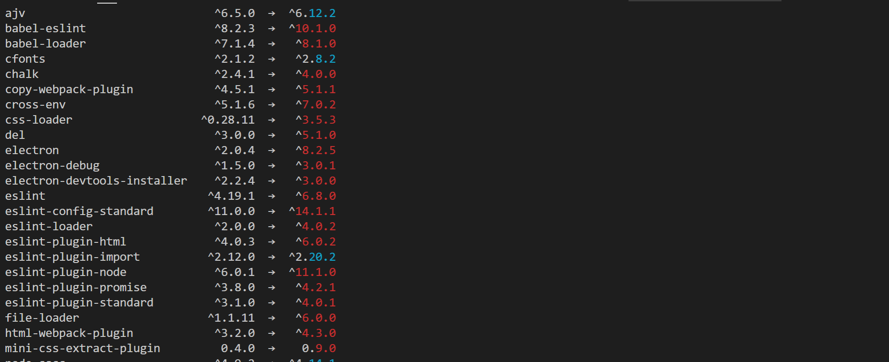
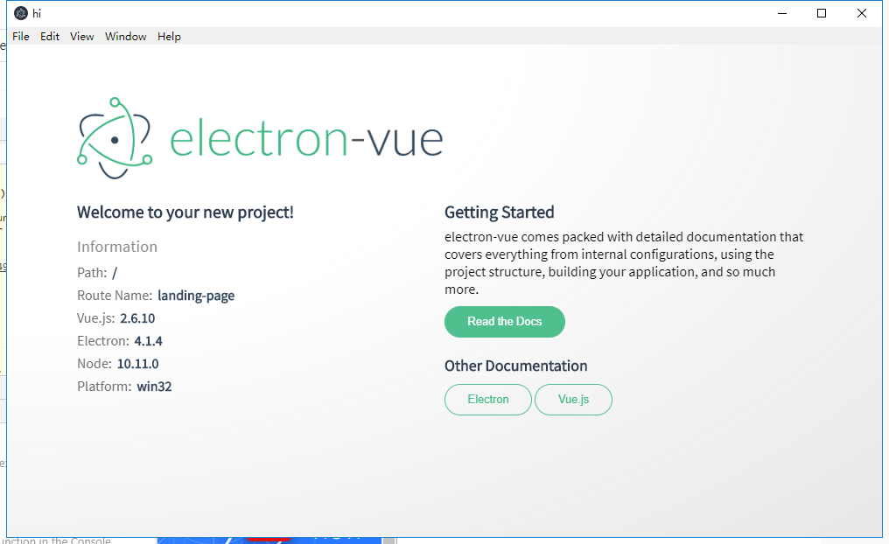

# 初始化项目

Electron-Vue中文介绍官方网站，内容挺多的，从头看一遍，后面有很多地方需要参考这些资料。
https://simulatedgreg.gitbooks.io/electron-vue/content/cn/

先不用急着npm install，因为我们要先升级部分包。

## 1.安装Electron-vue并初始化

``` bash
# 安装 vue-cli 和 脚手架样板代码
npm install -g vue-cli
vue init simulatedgreg/electron-vue my-project
```
## 2.安装npm-check-updates并升级部分包
``` bash
npm install -g npm-check-updates //全局安装
ncu -u // 检查更新
```


## 3. npm run install
``` bash
npm install
```
## 4. npm run dev

``` bash
npm run dev
```
