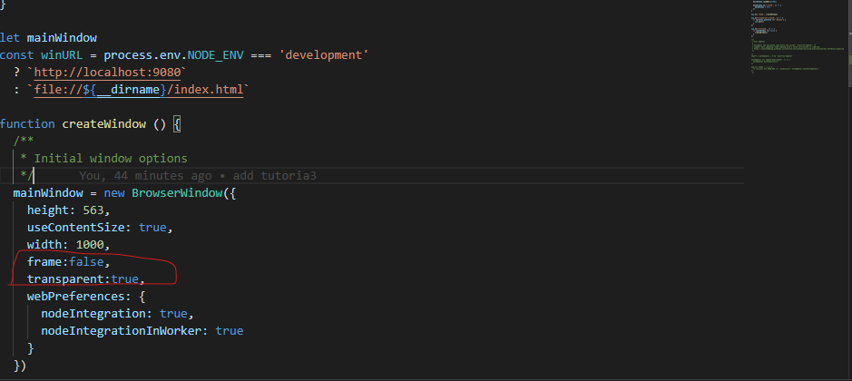
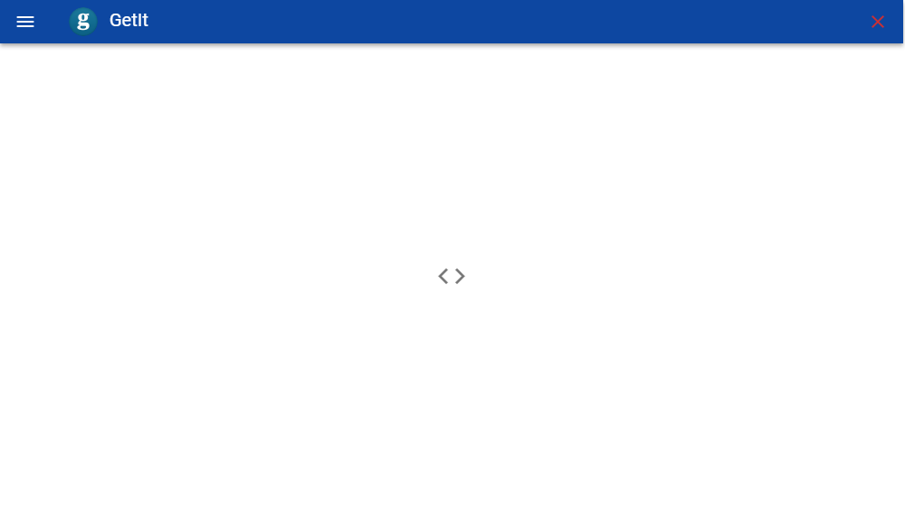

# 界面优化

## 设置无边框

在src/main/index.js中添加BrowserWindow参数，frame: false 就是设置无边框窗体，transparent: true 是设置透明，这俩个需要配合使用。
调整

``` javascript
  mainWindow = new BrowserWindow({
    height: 563,
    useContentSize: true,
    width: 1000,
    frame:false,
    transparent:true,
    webPreferences: {
      nodeIntegration: true,
      nodeIntegrationInWorker: true
    }
  })
```
## 去除丑陋的滚动条

窗体默认是带着滚动条的，比较丑陋，尤其是设置了无边框窗体之后，十分违和，所以我们手动修改下。

``` html
<style>
/*定义滚动条高宽及背景 高宽分别对应横竖滚动条的尺寸*/
::-webkit-scrollbar {
width: 2px; /*滚动条宽度*/
}
/*定义滑块 内阴影+圆角*/
::-webkit-scrollbar-thumb {
border-radius: 99px; /*滚动条的圆角*/
}
</style>
```
## 自定义关闭按钮

``` html
      <v-btn icon class="no-drag">
        <v-icon color="red darken-2">mdi-close</v-icon>
      </v-btn>
```

自定义按钮我们是放在了src-renderer-layout-layout文件中的v-toolbar 组件中。 因为标题需要需要拖拽，所以我们给它加上样式

style="-webkit-app-region: drag;"

但同时按钮，文字之类的不应该被拖拽，所以我们给这些元素全都加上样式

style="-webkit-app-region: no-drag"

``` css
.drag{
      -webkit-app-region: drag
}
.no-drag *{
  -webkit-app-region: no-drag
  }
```
## 最终效果
